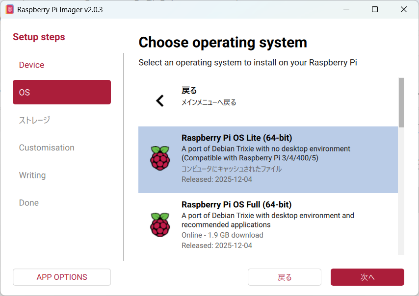

# CRDED-AIOps ドキュメント

## 概要

1. 5 分ごとに SINDAN クライアント（`/home/{username}/sindan-client`）を実行してデータ収集
    - 実行中のログは `/home/{username}/log/tmp/` に保存される
    - 取得されるデータは [下記](https://github.com/labnet-member/CRDED-AIOps-DevDocs?tab=readme-ov-file#sindan-%E3%82%AF%E3%83%A9%E3%82%A4%E3%82%A2%E3%83%B3%E3%83%88%E3%81%AE%E5%87%BA%E5%8A%9B%E3%83%87%E3%83%BC%E3%82%BF%E6%A6%82%E8%A6%81) 参照
2. 終了後に Python プログラム（`/home/{username}/sinetstream-client`）を実行して EMQX に診断結果を送信
    - 実行後のファイルは `/home/{username}/log/sent/` に zip 形式で保存される（ただし，30 日より古いファイルは削除）
    - トピック名は`sindan/{hostname}/phase{0-6}`（詳細は [ここ](https://github.com/labnet-member/CRDED-AIOps-DevDocs/blob/main/docs/sinetstream-client/output-sample.md) を参照）

ダッシュボードからリアルタイムにデータを閲覧可能（未実装）

---

## OS イメージのセットアップからシステムを動作させるまで
1. Raspberry Pi Imager で最新の Raspberrypi OS イメージを書き込む



2. パッケージ情報を更新・パッケージアップグレードを実施

```bash
sudo apt update
sudo apt upgrade
``` 


3. SINDAN クライアントのセットアップ
    - 詳細: [SINDAN クライアント実行までのセットアップ手順](https://github.com/labnet-member/CRDED-AIOps-DevDocs/blob/main/docs/sindan-client/setup.md)

4. SINETStream クライアントのセットアップ
    - 詳細: [SINETStream 送信プログラム実行までのセットアップ手順](https://github.com/labnet-member/CRDED-AIOps-DevDocs/blob/main/docs/sinetstream-client/setup/client.md)

5. セキュリティ関連のセットアップ
    - 詳細: [ファイアウォール設定・WireGuard 設定](https://github.com/labnet-member/CRDED-AIOps-DevDocs/blob/main/docs/security-setup.md)
---

## セキュリティ
[具体的な設定内容はここを参照](https://github.com/labnet-member/CRDED-AIOps-DevDocs/blob/main/docs/security-setup.md)

### ファイアウォール（スタンドアロン環境）
- 外部通信を遮断する設定を適用

### SSH
- 配布済みのユーザ名およびパスワードでログインする
- 公開鍵認証の設定なし

### VPN
- WireGuard 使用
- インターフェース名は `client0`

---

## SINDAN クライアントの出力データ概要
[詳細はここを参照](https://github.com/labnet-member/CRDED-AIOps-DevDocs/blob/main/docs/sindan-client/sindan-output-reference.md)

- **Phase 0: Hardware Layer**
    - ハードウェアに関する基礎情報と時刻同期状態

- **Phase 1: Datalink Layer**
    - 通信インタフェースの状態と周囲の無線環境

- **Phase 2: Interface Layer**
    - ネットワークインタフェースの IP 層設定状況

- **Phase 3: Localnet Layer**
    - ネットワーク内部での疎通状況
    - 計測項目:
        - 通信状態（status）
        - 応答遅延（rtt）
        - パケット損失率（loss）

- **Phase 4: Globalnet Layer**
    - ネットワーク外部への疎通状況
    - 計測項目:
        - 通信状態（status）
        - 応答遅延（rtt）
        - パケット損失率（loss）

- **Phase 5: DNS Layer**
    - ネットワークの名前解決を確認
    - 参照サーバ（resolve server）
        - dual.sindan-net.com
        - ipv4.sindan-net.com
        - ipv6.sindan-net.com
    - 測定項目: 各参照サーバに対して以下の項目を測定
        - 応答状態（status）
        - TTL（result(ttl)）
        - クエリ時間（query time）

- **Phase 6: Application Layer**
    - アプリケーション通信（HTTP・SSH・Speedtest）レベルでの外部接続性能と信頼性の最終確認

---

## リポジトリ構成

| フォルダ | 内容 |
|-----------|------|
| [docs/environment.md](https://github.com/labnet-member/CRDED-AIOps-DevDocs/tree/main/docs/environment.md) | 各大学に配布する Raspberry Pi の環境に関する情報を記録 |
| [docs/security-setup.md](https://github.com/labnet-member/CRDED-AIOps-DevDocs/blob/main/docs/security-setup.md) | ファイアウォール・WireGuard 設定 |
| [docs/sindan-client/](https://github.com/labnet-member/CRDED-AIOps-DevDocs/tree/main/docs/sindan-client) | SINDAN クライアントセットアップ・出力データまとめ・~~デバッグ記録~~ |
| [docs/sinetstream-client/](https://github.com/labnet-member/CRDED-AIOps-DevDocs/tree/main/docs/sinetstream-client) | SINETStream クライアントセットアップ・出力データまとめ |
| [docs/visualization/](https://github.com/labnet-member/CRDED-AIOps-DevDocs/tree/main/docs/visualization) | （未）InfluxDB + Grafana による計測データの可視化設定手順 |


---

## 使用したコード
- SINDAN クライアント: https://github.com/labnet-member/sindan-client
    - ログの時刻や保存場所を変更（詳細は [ここ](https://github.com/labnet-member/CRDED-AIOps-DevDocs/blob/main/docs/sindan-client/other-changes.md) を参照）
- SINETStream クライアント: https://github.com/labnet-member/sinetstream-client.git

---

## 参考リンク
- [SINDAN Project](https://www.sindan-net.com/)
- [sindan-client](https://github.com/SINDAN/sindan-client)
- [sindan-docker](https://github.com/SINDAN/sindan-docker)
